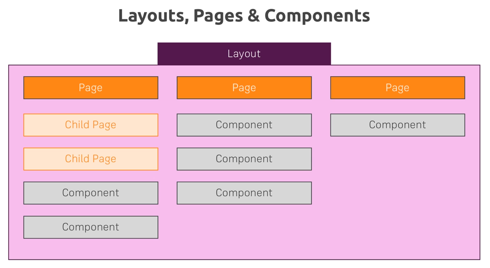

# PAGES

More information about the usage of this directory in [the documentation](https://nuxtjs.org/guide/routing).  
[More on Flexbox](https://academind.com/learn/css/understanding-css/flexbox-basics-container)

## Layout

[More on Views, Layouts etc](https://nuxtjs.org/guide/views)

### Custom Layout

- Without specifying the layout option of a vue file, pages component will use /layout/default.vue.
- If we create a new layout file, say, users.vue. The file must contain the `<nuxt />` tag in order for pages component to take place.
- Then we apply the layout in the pages component using the property `layout: 'users'` as property that is interpret by Nuxt, not Vue

### error.vue

- A reserved named file that will be loaded whenever your Nuxt application throw an error

## Routing

[More on Routing in Nuxt](https://nuxtjs.org/guide/routing)

### A) Naming with underscore

Nuxt allows setting up the route config via folder structure directly
any file named with a underscore ("\_") prefix will be treated as dynamic file that upon user input a value
it will be loaded and able to be retrieved via vue-router

- File based approach: `_id.vue` together with index.vue in the same folder
- Folder based approach : `/_id/index.vue`

Folder based approach makes the whole project looks more readable and easier to maintain

### B) Vue Router

By default vue-router is already injected to every vue component in Nuxt, so we have access to it using `this.$router` inside every Vue component.

- Use $router for action in scripts
- Use $route to access properties related to router
- $route.params gives you access of dynamic parameters input by user

### C) Navigating within the same page without rendering a new page

Using, say, `<a href="/users">Users</a>`, will allow you to navigate to users index.vue but it will do it by rerendering the whole page (i.e. sending request to server for this "/users" page), i.e. we are not staying in the single page application

With vue-router in general Vue application, we can use `<router-link>` for the purpose of staying in SPA. It uses the anchor tag `<a>` behind the scene but catches the vue-router link (e.g. "/users") and prevents the default behavior of sending a request.

In Nuxt, we use `<nuxt-link>` for this and it is just the same as `<router-link>`

### D) Page Validation

vue files in pages folder are different from those in components folder.
vue files in pages folder are loaded as the root pages for given url. Then we import reusable components from the components folder. This separates the pages file with the components file and satisfies the main objective of Vue: creating small and reusable components.

Remarks about pages components:

- The pages components don't just get rendered when you visit a certain URL.
- We can access all the default Vue properties in pages component.
- They also got some special properties in the Vue object. These properties will be ignored by VueJS but NuxtJS is gonna do something about it: e.g. page validation:
  - Validate is a special method nuxt executes before rendering a route.

### E) Nested routes

Load the content to be loaded into a Navigation page.
How to do it? Say you want to have nested routes in "/users"
We then do the following:

1. Adjust the naming:
   Create a new file "users.vue" next to the "users" folder, i.e. create in the pages folder directly has to have the same name as the folder.

   Inside pages folder -
   Before:  
    /users/\_id/index.vue  
    /users/index.vue

   After:  
    /users/\_id/index.vue  
    /users/index.vue  
    /users.vue

2. Move every line of code inside "/users/index.vue" to "users.vue"
3. Add a tag `<nuxt-child />` inside "users.vue" for any content you would like
4. Place any content you would like in "/users/index.vue" just to make sure there is content to show in "/users" route
