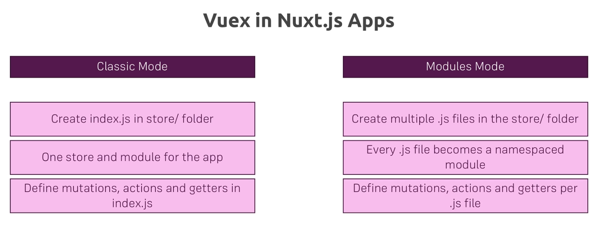

# STORE

We do not need to install additional packages to use VueX store. It is built in Nuxt already.

1. Create an index.js file in store and put `import Vuex from 'vuex` in the first line.
2. Create a function and we can name as we want, say, createStore because that is what it will do. We create a function instead of just an object which represents the store because it should be callable by Nuxt, which will execute it on the server to set up the store.
3. return we return a new store. If we returned an object instead of the function, then all users of our app would actually get the same instance because on the server in Node JS, where does runs?

If we have a plain object stored, well then we always get that object for every connected user.

If we have a function that returns a new store, as this does, then every new user receives his own

store, which we of course want, especially if we start managing user specific data in the store.

So here we got the view X stored and it's now initialized with a JavaScript object where you can set

up your starting state, your mutation's and so on.

So typically these are the building blocks you have and these are the normal building blocks you have

**This directory is not required, you can delete it if you don't want to use it.**

This directory contains your Vuex Store files.
Vuex Store option is implemented in the Nuxt.js framework.

Creating a file in this directory automatically activates the option in the framework.

More information about the usage of this directory in [the documentation](https://nuxtjs.org/guide/vuex-store).

## Classic Mode

- Create an index.js in store folder and then you have one store and one module for the entire app
- You can then add mutation's actions and getters and so on to the index.js

## Modules Mode

- If you have more data that goes into your store, you want to create multiple dot JS files in store folder where the name in front of DOT is the name of the module and you have namespaced modules.
- It allows you to slice your store up into different modules so that you don't end up with one gigantic index
- you still define mutation's and so on, but in the different dot js files for the given module.
